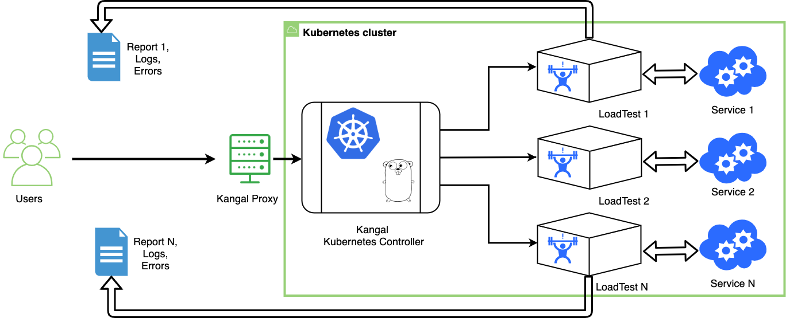

# Kangal - Automatic loader
[](https://artifacthub.io/packages/search?repo=kangal)
[](https://codecov.io/gh/hellofresh/kangal)
<p align="center"></p>

Run performance tests in Kubernetes cluster with Kangal.
___

## Table of content
- [Why Kangal?](#why-kangal)
- [Key features](#key-features)
- [How it works](#how-it-works)
- [Architectural diagram](#architectural-diagram)
- [Components](#components)
    - [LoadTest Custom Resource](#loadtest-custom-resource)
    - [Kangal Proxy](#kangal-proxy)
    - [Kangal Controller](#kangal-controller)
- [Quickstart guide](#quickstart-guide)
    - [Installing using helm](#installing-using-helm)
    - [Creating first LoadTest](#creating-first-loadtest)
- [Documentation](docs/README.md)
- [Contributing](#contributing)
- [Support](#support)

## Why Kangal?
In Kangal project, the name stands for "**K**ubernetes **an**d **G**o **A**utomatic **L**oader".
But originally Kangal is the breed of a shepherd dog. Let the smart and protective dog herd your load testing projects.

With Kangal, you can spin up an isolated environment in a Kubernetes cluster to run performance tests using different load generators.

## Key features
- **create** an isolated Kubernetes environment with an opinionated load generator installation
- **run** load tests against any desired environment
- **monitor** load tests metrics in Grafana
- **save the report** for the successful load test
- **clean up** after the test finishes

## How it works
Kangal application uses Kubernetes [Custom Resources](https://kubernetes.io/docs/concepts/extend-kubernetes/api-extension/custom-resources/).

LoadTest custom resource (CR) is a main working entity.
LoadTest custom resource definition (CRD) can be found in [charts/kangal/crd.yaml](charts/kangal/crd.yaml).

Kangal application contains two main parts:
 - **Proxy** to create, delete and check load tests and reports via REST API requests
 - **Controller** to operate with LoadTest custom resource and other Kubernetes entities.

Kangal also uses S3 compatible storage to save test reports. 

## Architectural diagram
The diagram below illustrates the workflow for Kangal in Kubernetes infrastructure.

<p align="left">
 <a href="architectural_diagram.png">
   
 </a>
</p>

## Components
### LoadTest Custom Resource
A new custom resource in the Kubernetes cluster which contains requirements for performance testing environments.

More info about the Custom Resources in [official Kubernetes documentation](https://kubernetes.io/docs/concepts/extend-kubernetes/api-extension/custom-resources/).

### Kangal Proxy
Provides the following HTTP methods for `/load-test` endpoint:
 - POST - allowing the user to create a new LoadTest
 - GET - allowing the user to see current LoadTest status / logs / report / metrics
 - DELETE - allowing the user to stop and delete existing LoadTest

 The Kangal Proxy is documented using the [OpenAPI Spec](https://swagger.io/specification/).

 If you prefer to use Postman you can also import [openapi.json](openapi.json) file into Postman to create a new collection.

### Kangal Controller
The component is responsible for managing all the aspects of the performance testing process.

## Quickstart guide
This tutorial will guide through Kangal installation process and usage.

### Installing using helm
First, let's create the Custom Resource Definition by running:

```shell
$ kubectl apply -f https://raw.githubusercontent.com/hellofresh/kangal/master/charts/kangal/crd.yaml
```

Now, install the chart using following commands:

```shell
$ helm repo add kangal https://hellofresh.github.io/kangal
$ helm install --set environment=dev kangal kangal/kangal
```

That's it, Kangal should be installed, check if is all correct by running:

```shell
$ kubectl get pods
NAME                                 READY   STATUS    RESTARTS   AGE
kangal-controller-588677b854-r9qcs   1/1     Running   0          44s
kangal-openapi-ui-7c5dd8997c-jj4mk   1/1     Running   0          44s
kangal-openapi-ui-7c5dd8997c-vgm8c   1/1     Running   0          44s
kangal-proxy-7d95c9d65-6t44b         1/1     Running   0          44s
kangal-proxy-7d95c9d65-75dv4         1/1     Running   0          44s

$ kubectl get crd
NAME                                          CREATED AT
loadtests.kangal.hellofresh.com               2019-11-15T10:59:05Z
```

For more information about the Helm Chart check [charts/kangal/README.md](charts/kangal/README.md).

### Creating first LoadTest
To run an LoadTest you first need to find Kangal proxy endpoint, use this command:

```shell
$ kubectl get ingress
NAME                HOSTS                  ADDRESS     PORTS   AGE
kangal-openapi-ui   kangal-openapi.local   localhost   80      5m48s
kangal-proxy        kangal-proxy.local     localhost   80      5m48s
```

> This is assuming you have a proper configured [Ingress Controller](https://kubernetes.io/docs/concepts/services-networking/ingress-controllers/), if is not the case you can use [Port Forwarding](https://kubernetes.io/docs/tasks/access-application-cluster/port-forward-access-application-cluster/).

With this information, you are now able to do a request to create the first load test.
Let's start by downloading an example JMeter test and POST it to Kangal proxy.

```shell
$ curl -s -O https://raw.githubusercontent.com/hellofresh/kangal/master/examples/constant_load.jmx
$ curl \
    -H "Host: kangal-proxy.local" \
    -F "distributedPods=1" \
    -F "testFile=@constant_load.jmx" \
    -F "type=JMeter" \
    -F "overwrite=true" \
    http://localhost:80/load-test
{"type":"JMeter","distributedPods":1,"loadtestName":"loadtest-dunking-hedgehog","phase":"creating","hasEnvVars":false,"hasTestData":false}
```

Your first load test was created successfully, in this example with the name `loadtest-dunking-hedgehog`.

Kangal Controller will automatically create a namespace for your load test and deploy the backend (in this case JMeter), check that by running:

```
$ kubectl get namespaces
NAME                        STATUS   AGE
...
loadtest-dunking-hedgehog   Active   3s
```

And you can check if the Pods started correctly using:

```
$ kubectl get pods --namespace=loadtest-dunking-hedgehog
NAME                    READY   STATUS    RESTARTS   AGE
loadtest-master-f6xpb   1/1     Running   0          18s
loadtest-worker-000     1/1     Running   0          22s
```

## Documentation
Read more at [docs/README.md](docs/README.md).

## Contributing
To start contributing, please check [CONTRIBUTING.md](CONTRIBUTING.md).

## Support
If you need support, start with the [troubleshooting guide](docs/troubleshooting.md), and work your way through the process that we've outlined.
