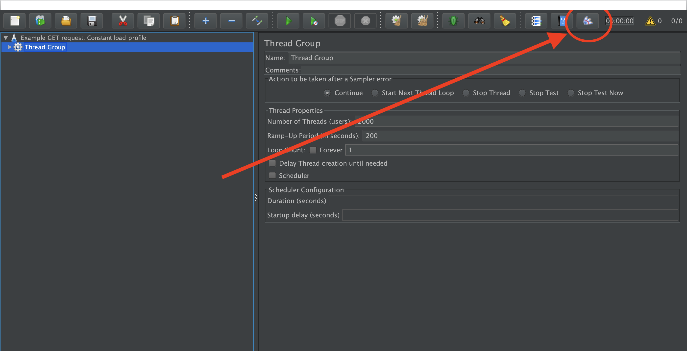
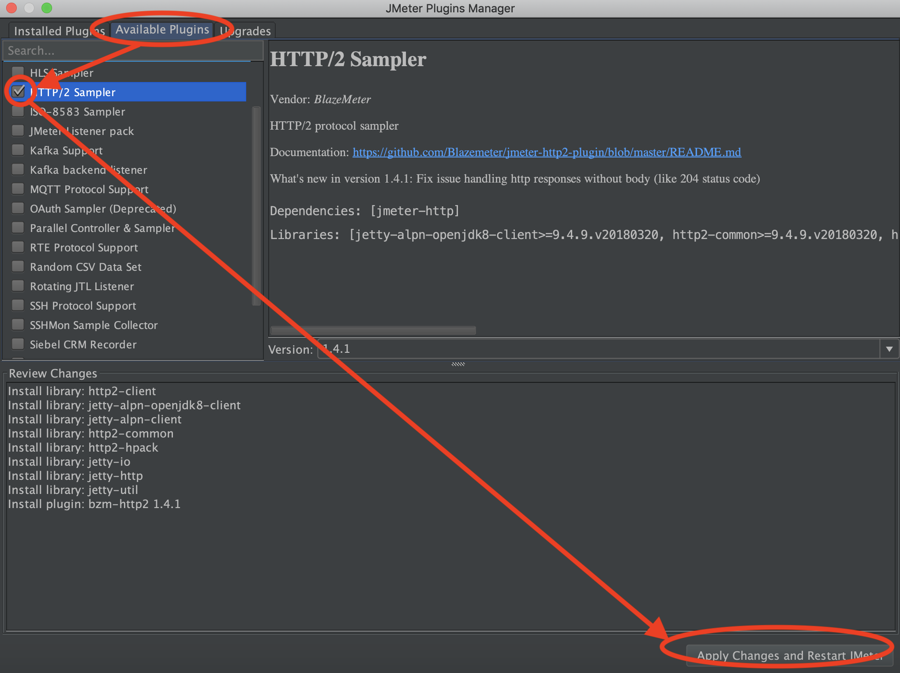

# JMeter

## Table of content
- [Installing JMeter for local test development](#installing-jmeter-for-local-test-development)
- [Required JMeter plugins](#required-jmeter-plugins)
- [Writing tests](writing-tests.md)
- [Reporting](reporting.md)

JMeter is one of the load generators used in Kangal. A powerful tool which can be used for different performance testing tasks.

Currently Kangal uses the docker image [hellofreshtech/kangal-jmeter](https://github.com/hellofresh/kangal-jmeter) based on JMeter v5.0 r1840935.

Apache JMeter features include ability to create and run performance test for different applications/server/protocol types:

* Web - HTTP, HTTPS (Java, NodeJS, PHP, ASP.NET, …)
* SOAP / REST Webservices
* Database via JDBC
* LDAP
* and many more ...

Kangal requires a jmx testfile describing the test. 
To create and edit jmx files we recommend you to install JMeter locally.

## Installing JMeter for local test development
1. Install Java 8+ from [official Java website](https://www.java.com/de/download/).
2. Install JMeter v5.0 r1840935 from [official JMeter website](https://archive.apache.org/dist/jmeter/binaries/) or using [brew](https://stackoverflow.com/questions/22610316/how-do-i-install-jmeter-on-a-mac).
3. Run JMeter UI from your terminal by command jmeter or follow the [official documentation](https://jmeter.apache.org/usermanual/get-started.html#running).

## Required JMeter plugins
1. Check if you have Plugins Manager installed, if not follow the [official instructions](https://jmeter-plugins.org/wiki/PluginsManager/).
2. Open JMeter UI and click the right button in the top row.
3. In the opened window got to Available Plugins tab and chose the plugin from the list. Then press **Apply Changes and restart JMeter** button.

List of external JMeter plugins used in Kangal setup:

* jpgc-tst=2.5 [Throughput Shaping Timer](https://jmeter-plugins.org/wiki/ThroughputShapingTimer/)
* jpgc-casutg=2.6 [Concurrency Thread Group](https://jmeter-plugins.org/wiki/ConcurrencyThreadGroup/)
* jpgc-fifo [Inter-Thread Communication](https://jmeter-plugins.org/wiki/InterThreadCommunication/)
* jpgc-functions [Custom JMeter Functions](https://jmeter-plugins.org/wiki/Functions/)

You can also use and modify example test files from [Kangal repository](/examples) as described at [docs/jmeter/writing-tests.md](/docs/jmeter/how-to-write-tests.md).
Reading the [offical documentation](https://jmeter.apache.org/usermanual/test_plan.html) is strongly recommend to understand major concepts.
