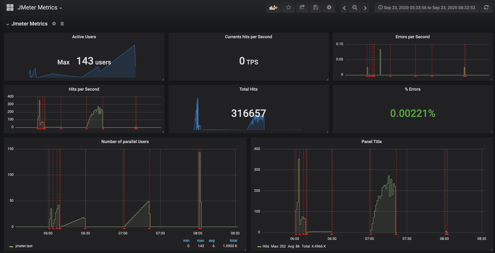

# Reporting in JMeter
- [Live metrics report](#live-metrics-report)
- [Static report](#static-report)

## Live metrics report
JMeter offers a possibility to send live metrics from the running test to InfluxDB (see [details in the related JMeter documentation](writing-tests.md#metrics-collector)).
This will help you to monitor current behaviour of your test and the service under the test. 
InfluxDB installed in your cluster is required to enable this functionality.
> Note: InfluxDB is not the part of Kangal, read more about it in [InfluxDB official documentation](https://github.com/influxdata/influxdb).

You can use InfluxDB as a datasource for Grafana and create a set of useful graphs.

## Static report
JMeter also offers a functionality to generate HTML report dashboards after the end of the test. Read more about it [in official JMeter documentation](https://jmeter.apache.org/usermanual/generating-dashboard.html).

The [hellofresh/kangal-jmeter](https://github.com/hellofresh/kangal-jmeter) docker image implements this functionality.

### CSV Results
The CSV file containing all requests will be persisted within the reports, you can get this file from the report using the following URL:

> https://${KANGAL_PROXY_ADDRESS}/load-test/{loadtest-name}/report/results.csv

To read more about the REST API, check [User Flow documentation](../user-flow.md)
