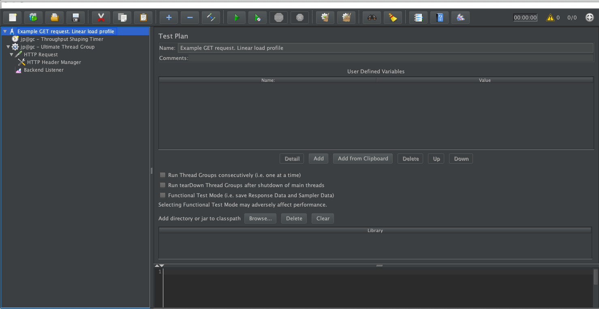
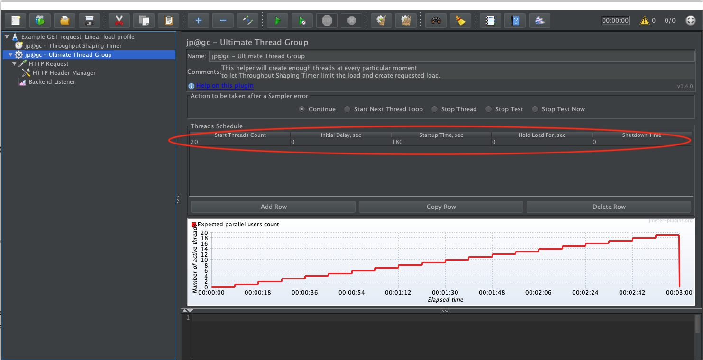
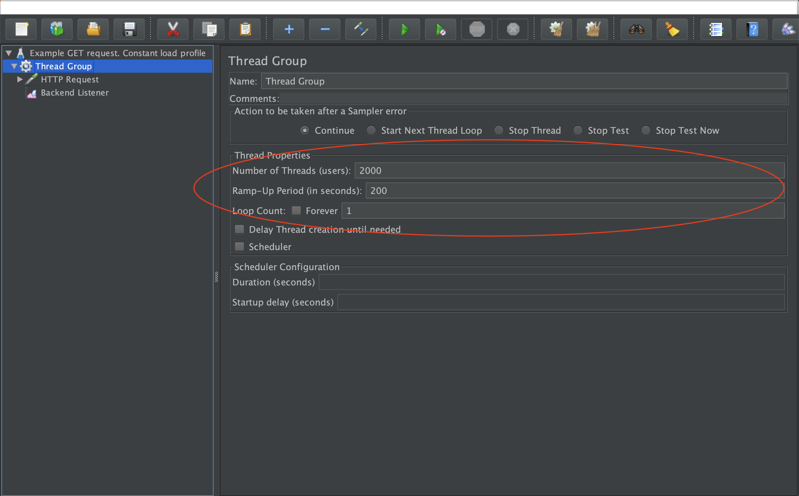
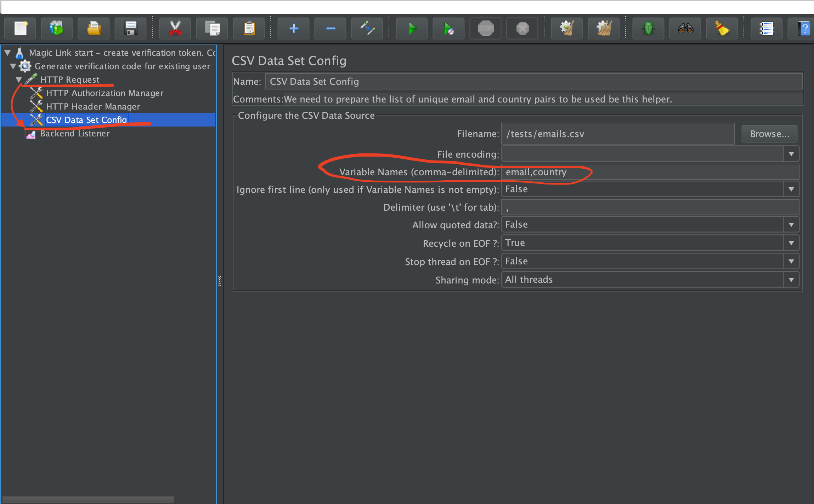
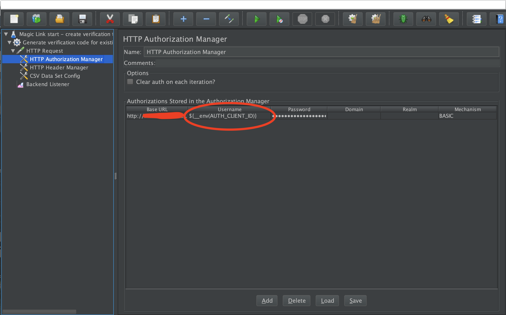

# How to write and understand a JMeter test

- [Introduction](#introduction)
- [General recommendations](#general-recommendations)
  - [Tests with test data](#tests-with-test-data)
  - [Tests with environment variables](#tests-with-environment-variables)
- [Example Test 1: Linearly growing load](#example-test-1-linearly-growing-load)
  - [Test Plan](#test-plan)
  - [Create load profile with Throughput Shaping Timer](#create-load-profile-with-throughput-shaping-timer)
  - [Add enough threads](#add-enough-threads)
  - [Where to shoot](#where-to-shoot)
  - [Request headers](#request-headers)
  - [Metrics collector](#metrics-collector)
- [Example Test 2: Constant load](#example-test-2-constant-load)
  - [Thread group](#thread-group)
- [Test with CSV data](#test-with-csv-data)
- [Test with environment variables](#test-with-environment-variables)
- [Test with custom data](#test-with-custom-data)

## Introduction

Before starting with creation of JMeter tests for Kangal, you need to install JMeter locally following the instructions from the [Helm Chart](https://github.com/hellofresh/kangal/blob/master/charts/kangal/README.md) page.

[Kangal repository](https://github.com/hellofresh/kangal/tree/master/examples) has some simple tests examples that can help you with a quick start.

Every element of the test can be modified, disabled or removed. You can also add new elements like Assertions, Timers, Listeners and Config elements. Please, follow the instructions from official [JMeter user manual](https://jmeter.apache.org/usermanual/component_reference.html#introduction).

## General recommendations
### Tests with test data
Some test scenarios require unique request or at least some amount of varied data in requests. For this purpose JMeter allows you to use external data sets in a CSV format. Read more about [CSV DataSetConfig](https://jmeter.apache.org/usermanual/component_reference.html#CSV_Data_Set_Config) in official JMeter documentation.

1. Prepare your test data in CSV file
2. Configure test script accordingly. Jump to section [Test with CSV Data](#test-with-csv-data)
3. Add both files in POST request to Kangal API

Kangal will split the test data equally between all the distributed pods you requested, so every pod will have a unique piece of your test data file and requests from different pods will not be duplicated. If you have only one distributed pod no data splitting will take place.

### Tests with environment variables
Some tests may contain sensitive information like DB connection parameters, authorization tokens, etc. You can provide this information as environment variables which will be applied in load test environment before running test.

Kangal allows you to use a file with env vars saved in CSV format. Please configure your test script accordingly to use env vars. Read more about using env vars in official [JMeter-plugin documentation](https://jmeter-plugins.org/wiki/Functions/#envsupfont-color-gray-size-1-since-1-2-0-font-sup).

1. Save your environment variables in CSV file
2. Configure test script accordingly. Jump to section [Test with environment variables](#test-with-environment-variables)
3. Add both files in POST request to Kangal API

## Example Test 1: Linearly growing load
```xml
<details>
    <summary>Example</summary>
    <?xml version="1.0" encoding="UTF-8"?>
    <jmeterTestPlan version="1.2" properties="5.0" jmeter="5.0 r1840935">
      <hashTree>
        <TestPlan guiclass="TestPlanGui" testclass="TestPlan" testname="Example GET request. Linear load profile " enabled="true">
          <stringProp name="TestPlan.comments"></stringProp>
          <boolProp name="TestPlan.functional_mode">false</boolProp>
          <boolProp name="TestPlan.serialize_threadgroups">false</boolProp>
          <elementProp name="TestPlan.user_defined_variables" elementType="Arguments" guiclass="ArgumentsPanel" testclass="Arguments" testname="User Defined Variables" enabled="true">
            <collectionProp name="Arguments.arguments"/>
          </elementProp>
          <stringProp name="TestPlan.user_define_classpath"></stringProp>
        </TestPlan>
        <hashTree>
          <kg.apc.jmeter.timers.VariableThroughputTimer guiclass="kg.apc.jmeter.timers.VariableThroughputTimerGui" testclass="kg.apc.jmeter.timers.VariableThroughputTimer" testname="jp@gc - Throughput Shaping Timer" enabled="true">
            <collectionProp name="load_profile">
              <collectionProp name="-1114121389">
                <stringProp name="49">1</stringProp>
                <stringProp name="49586">200</stringProp>
                <stringProp name="48873">180</stringProp>
              </collectionProp>
            </collectionProp>
            <stringProp name="TestPlan.comments">This helper will create the load growing linearly from 1 to 200 RPS. It's used to form a load and can only limit it. </stringProp>
          </kg.apc.jmeter.timers.VariableThroughputTimer>
          <hashTree/>
          <kg.apc.jmeter.threads.UltimateThreadGroup guiclass="kg.apc.jmeter.threads.UltimateThreadGroupGui" testclass="kg.apc.jmeter.threads.UltimateThreadGroup" testname="jp@gc - Ultimate Thread Group" enabled="true">
            <collectionProp name="ultimatethreadgroupdata">
              <collectionProp name="874281578">
                <stringProp name="1598">20</stringProp>
                <stringProp name="48">0</stringProp>
                <stringProp name="48873">180</stringProp>
                <stringProp name="48">0</stringProp>
                <stringProp name="48">0</stringProp>
              </collectionProp>
            </collectionProp>
            <elementProp name="ThreadGroup.main_controller" elementType="LoopController" guiclass="LoopControlPanel" testclass="LoopController" testname="Loop Controller" enabled="true">
              <boolProp name="LoopController.continue_forever">false</boolProp>
              <intProp name="LoopController.loops">-1</intProp>
            </elementProp>
            <stringProp name="ThreadGroup.on_sample_error">continue</stringProp>
            <stringProp name="TestPlan.comments">This helper will create enough threads at every particular moment to let Throughput Shaping Timer limit the load and create requested load. </stringProp>
          </kg.apc.jmeter.threads.UltimateThreadGroup>
          <hashTree>
            <HTTPSamplerProxy guiclass="HttpTestSampleGui" testclass="HTTPSamplerProxy" testname="HTTP Request" enabled="true">
              <elementProp name="HTTPsampler.Arguments" elementType="Arguments" guiclass="HTTPArgumentsPanel" testclass="Arguments" testname="User Defined Variables" enabled="true">
                <collectionProp name="Arguments.arguments"/>
              </elementProp>
              <stringProp name="HTTPSampler.domain"><TEST_DOMAIN></stringProp>
              <stringProp name="HTTPSampler.port"></stringProp>
              <stringProp name="HTTPSampler.protocol">http</stringProp>
              <stringProp name="HTTPSampler.contentEncoding"></stringProp>
              <stringProp name="HTTPSampler.path">/</stringProp>
              <stringProp name="HTTPSampler.method">GET</stringProp>
              <boolProp name="HTTPSampler.follow_redirects">true</boolProp>
              <boolProp name="HTTPSampler.auto_redirects">false</boolProp>
              <boolProp name="HTTPSampler.use_keepalive">true</boolProp>
              <boolProp name="HTTPSampler.DO_MULTIPART_POST">false</boolProp>
              <stringProp name="HTTPSampler.embedded_url_re"></stringProp>
              <stringProp name="HTTPSampler.connect_timeout"></stringProp>
              <stringProp name="HTTPSampler.response_timeout"></stringProp>
              <stringProp name="TestPlan.comments">Every request should be unique. We use prepared data set in CSV Data Set Config</stringProp>
            </HTTPSamplerProxy>
            <hashTree>
              <HeaderManager guiclass="HeaderPanel" testclass="HeaderManager" testname="HTTP Header Manager" enabled="true">
                <collectionProp name="HeaderManager.headers">
                  <elementProp name="" elementType="Header">
                    <stringProp name="Header.name">Content-Type</stringProp>
                    <stringProp name="Header.value">application/json, text/plain, */*</stringProp>
                  </elementProp>
                </collectionProp>
              </HeaderManager>
              <hashTree/>
            </hashTree>
            <BackendListener guiclass="BackendListenerGui" testclass="BackendListener" testname="Backend Listener" enabled="true">
              <elementProp name="arguments" elementType="Arguments" guiclass="ArgumentsPanel" testclass="Arguments" enabled="true">
                <collectionProp name="Arguments.arguments">
                  <elementProp name="influxdbMetricsSender" elementType="Argument">
                    <stringProp name="Argument.name">influxdbMetricsSender</stringProp>
                    <stringProp name="Argument.value">org.apache.jmeter.visualizers.backend.influxdb.HttpMetricsSender</stringProp>
                    <stringProp name="Argument.metadata">=</stringProp>
                  </elementProp>
                  <elementProp name="influxdbUrl" elementType="Argument">
                    <stringProp name="Argument.name">influxdbUrl</stringProp>
                    <stringProp name="Argument.value"><influxdbURL>/write?db=jmeter</stringProp>
                    <stringProp name="Argument.metadata">=</stringProp>
                  </elementProp>
                  <elementProp name="application" elementType="Argument">
                    <stringProp name="Argument.name">application</stringProp>
                    <stringProp name="Argument.value">session-tracking-linear</stringProp>
                    <stringProp name="Argument.metadata">=</stringProp>
                  </elementProp>
                  <elementProp name="measurement" elementType="Argument">
                    <stringProp name="Argument.name">measurement</stringProp>
                    <stringProp name="Argument.value">jmeter</stringProp>
                    <stringProp name="Argument.metadata">=</stringProp>
                  </elementProp>
                  <elementProp name="summaryOnly" elementType="Argument">
                    <stringProp name="Argument.name">summaryOnly</stringProp>
                    <stringProp name="Argument.value">false</stringProp>
                    <stringProp name="Argument.metadata">=</stringProp>
                  </elementProp>
                  <elementProp name="samplersRegex" elementType="Argument">
                    <stringProp name="Argument.name">samplersRegex</stringProp>
                    <stringProp name="Argument.value">.*</stringProp>
                    <stringProp name="Argument.metadata">=</stringProp>
                  </elementProp>
                  <elementProp name="percentiles" elementType="Argument">
                    <stringProp name="Argument.name">percentiles</stringProp>
                    <stringProp name="Argument.value">90;95;99</stringProp>
                    <stringProp name="Argument.metadata">=</stringProp>
                  </elementProp>
                  <elementProp name="testTitle" elementType="Argument">
                    <stringProp name="Argument.name">testTitle</stringProp>
                    <stringProp name="Argument.value">Test name</stringProp>
                    <stringProp name="Argument.metadata">=</stringProp>
                  </elementProp>
                  <elementProp name="eventTags" elementType="Argument">
                    <stringProp name="Argument.name">eventTags</stringProp>
                    <stringProp name="Argument.value"></stringProp>
                    <stringProp name="Argument.metadata">=</stringProp>
                  </elementProp>
                </collectionProp>
              </elementProp>
              <stringProp name="classname">org.apache.jmeter.visualizers.backend.influxdb.InfluxdbBackendListenerClient</stringProp>
              <stringProp name="TestPlan.comments">This listener will send data to Influx DB.</stringProp>
            </BackendListener>
            <hashTree/>
          </hashTree>
        </hashTree>
      </hashTree>
    </jmeterTestPlan>
</details>
```

### Test Plan
Test Plan element is the root of the test. Inside it, you can find all the nested required elements for test configuration.

{ height=500 }

### Create load profile with Throughput Shaping Timer
The first important element in the configuration is a **Throughput Shaping Timer**. More information about this element can be found in the [official docs](https://jmeter-plugins.org/wiki/ThroughputShapingTimer/?utm_source=jmeter&utm_medium=helplink&utm_campaign=ThroughputShapingTimer)

Values to manipulate:

- Start RPS
- End RPS
- Duration

### Add enough threads
Second required element is **Concurrency Thread Group**. A [Thread Group](https://jmeter-plugins.org/wiki/ConcurrencyThreadGroup/) basically is a pool of virtual users that will execute a particular test case against your server. In our case - every thread will make a particular call to exact endpoint specified in HTTP request element.

Values to manipulate:

- Start Threads Count
- Startup Time

With this two values you can regulate the number of the threads created during the tests. With other parameters you can change the thread creation profile, but it's not needed in our example.

**The number of threads sufficient for every other test may differ and depend on test case.**

In this example we advise to use thread count growing up to 20 threads during the test time (same time specified in Throughput Shaping Timer element).

{ height=500 }

### Where to shoot
Next important element is [HTTP request](https://jmeter.apache.org/usermanual/component_reference.html#HTTP_Request_Defaults) itself.

Values to manipulate:

- Protocol (HTTP/HTTPS)
- Server name or IP (e.g. 127.0.0.1)
- Method (e.g. GET)
- Path (e.g. /info)

You can also provide request parameters and body data with this configuration element.

### Request headers
For some requests may be necessary to specify some headers. You can do it with HTTP Header Manager

### Metrics collector
To send the metrics to JMeter Grafana dashboard we use [Backend Listener](https://jmeter.apache.org/usermanual/component_reference.html#Backend_Listener) element.

Values to manipulate:

- backend listener implementation (in our case it's **org.apache.jmeter.visualizers.backend.influxdb.HttpMetricsSender**)
- InfluxDB URL
- application

Application field allows you set a unique name for your test metrics. With this unique name you can find the results of your test in Grafana by selecting it in App dropdown.

## Example Test 2: Constant load
```xml
<details>
    <summary>Example</summary>
    <?xml version="1.0" encoding="UTF-8"?>
    <jmeterTestPlan version="1.2" properties="5.0" jmeter="5.0 r1840935">
      <hashTree>
        <TestPlan guiclass="TestPlanGui" testclass="TestPlan" testname="Example GET request. Constant load profile " enabled="true">
          <stringProp name="TestPlan.comments"></stringProp>
          <boolProp name="TestPlan.functional_mode">false</boolProp>
          <boolProp name="TestPlan.serialize_threadgroups">false</boolProp>
          <elementProp name="TestPlan.user_defined_variables" elementType="Arguments" guiclass="ArgumentsPanel" testclass="Arguments" testname="User Defined Variables" enabled="true">
            <collectionProp name="Arguments.arguments"/>
          </elementProp>
          <stringProp name="TestPlan.user_define_classpath"></stringProp>
        </TestPlan>
        <hashTree>
          <ThreadGroup guiclass="ThreadGroupGui" testclass="ThreadGroup" testname="Thread Group" enabled="true">
            <stringProp name="ThreadGroup.on_sample_error">continue</stringProp>
            <elementProp name="ThreadGroup.main_controller" elementType="LoopController" guiclass="LoopControlPanel" testclass="LoopController" testname="Loop Controller" enabled="true">
              <boolProp name="LoopController.continue_forever">false</boolProp>
              <stringProp name="LoopController.loops">1</stringProp>
            </elementProp>
            <stringProp name="ThreadGroup.num_threads">2000</stringProp>
            <stringProp name="ThreadGroup.ramp_time">200</stringProp>
            <boolProp name="ThreadGroup.scheduler">false</boolProp>
            <stringProp name="ThreadGroup.duration"></stringProp>
            <stringProp name="ThreadGroup.delay"></stringProp>
          </ThreadGroup>
          <hashTree>
            <HTTPSamplerProxy guiclass="HttpTestSampleGui" testclass="HTTPSamplerProxy" testname="HTTP Request" enabled="true">
              <elementProp name="HTTPsampler.Arguments" elementType="Arguments" guiclass="HTTPArgumentsPanel" testclass="Arguments" testname="User Defined Variables" enabled="true">
                <collectionProp name="Arguments.arguments"/>
              </elementProp>
              <stringProp name="HTTPSampler.domain"><TEST_DOMAIN></stringProp>
              <stringProp name="HTTPSampler.port"></stringProp>
              <stringProp name="HTTPSampler.protocol">http</stringProp>
              <stringProp name="HTTPSampler.contentEncoding"></stringProp>
              <stringProp name="HTTPSampler.path">/</stringProp>
              <stringProp name="HTTPSampler.method">GET</stringProp>
              <boolProp name="HTTPSampler.follow_redirects">true</boolProp>
              <boolProp name="HTTPSampler.auto_redirects">false</boolProp>
              <boolProp name="HTTPSampler.use_keepalive">true</boolProp>
              <boolProp name="HTTPSampler.DO_MULTIPART_POST">false</boolProp>
              <stringProp name="HTTPSampler.embedded_url_re"></stringProp>
              <stringProp name="HTTPSampler.connect_timeout"></stringProp>
              <stringProp name="HTTPSampler.response_timeout"></stringProp>
            </HTTPSamplerProxy>
            <hashTree>
              <HeaderManager guiclass="HeaderPanel" testclass="HeaderManager" testname="HTTP Header Manager" enabled="true">
                <collectionProp name="HeaderManager.headers">
                  <elementProp name="" elementType="Header">
                    <stringProp name="Header.name">Content-Type</stringProp>
                    <stringProp name="Header.value">application/json, text/plain, */*</stringProp>
                  </elementProp>
                </collectionProp>
              </HeaderManager>
              <hashTree/>
            </hashTree>
            <BackendListener guiclass="BackendListenerGui" testclass="BackendListener" testname="Backend Listener" enabled="false">
              <elementProp name="arguments" elementType="Arguments" guiclass="ArgumentsPanel" testclass="Arguments" enabled="true">
                <collectionProp name="Arguments.arguments">
                  <elementProp name="influxdbMetricsSender" elementType="Argument">
                    <stringProp name="Argument.name">influxdbMetricsSender</stringProp>
                    <stringProp name="Argument.value">org.apache.jmeter.visualizers.backend.influxdb.HttpMetricsSender</stringProp>
                    <stringProp name="Argument.metadata">=</stringProp>
                  </elementProp>
                  <elementProp name="influxdbUrl" elementType="Argument">
                    <stringProp name="Argument.name">influxdbUrl</stringProp>
                    <stringProp name="Argument.value">http://<influxdbURL>/write?db=jmeter</stringProp>
                    <stringProp name="Argument.metadata">=</stringProp>
                  </elementProp>
                  <elementProp name="application" elementType="Argument">
                    <stringProp name="Argument.name">application</stringProp>
                    <stringProp name="Argument.value">session-tracking-linear</stringProp>
                    <stringProp name="Argument.metadata">=</stringProp>
                  </elementProp>
                  <elementProp name="measurement" elementType="Argument">
                    <stringProp name="Argument.name">measurement</stringProp>
                    <stringProp name="Argument.value">jmeter</stringProp>
                    <stringProp name="Argument.metadata">=</stringProp>
                  </elementProp>
                  <elementProp name="summaryOnly" elementType="Argument">
                    <stringProp name="Argument.name">summaryOnly</stringProp>
                    <stringProp name="Argument.value">false</stringProp>
                    <stringProp name="Argument.metadata">=</stringProp>
                  </elementProp>
                  <elementProp name="samplersRegex" elementType="Argument">
                    <stringProp name="Argument.name">samplersRegex</stringProp>
                    <stringProp name="Argument.value">.*</stringProp>
                    <stringProp name="Argument.metadata">=</stringProp>
                  </elementProp>
                  <elementProp name="percentiles" elementType="Argument">
                    <stringProp name="Argument.name">percentiles</stringProp>
                    <stringProp name="Argument.value">90;95;99</stringProp>
                    <stringProp name="Argument.metadata">=</stringProp>
                  </elementProp>
                  <elementProp name="testTitle" elementType="Argument">
                    <stringProp name="Argument.name">testTitle</stringProp>
                    <stringProp name="Argument.value">Test name</stringProp>
                    <stringProp name="Argument.metadata">=</stringProp>
                  </elementProp>
                  <elementProp name="eventTags" elementType="Argument">
                    <stringProp name="Argument.name">eventTags</stringProp>
                    <stringProp name="Argument.value"></stringProp>
                    <stringProp name="Argument.metadata">=</stringProp>
                  </elementProp>
                </collectionProp>
              </elementProp>
              <stringProp name="classname">org.apache.jmeter.visualizers.backend.influxdb.InfluxdbBackendListenerClient</stringProp>
              <stringProp name="TestPlan.comments">This listener will send data to Influx DB.</stringProp>
            </BackendListener>
            <hashTree/>
          </hashTree>
        </hashTree>
      </hashTree>
    </jmeterTestPlan>
</details>
```

There is not much difference between constant and linear load tests. You can simulate constant load with the same **Throughput Shaping Timer** and **Concurrency Thread Group** configuration elements. But to keep it simple we can use only one element which is sufficient in this case.

### Thread group
With [thread group](https://jmeter.apache.org/usermanual/component_reference.html#Thread_Group) element you can define the duration of your test and a constant number of threads to perform the calls. JMeter runs the thread group until either the number of loops is reached or the duration/end-time is reached - whichever occurs first.

Values to manipulate:

- Number of Threads
- Ramp-Up Period
- Loop Count

With the values given in example test, you will get 2000 threads / 200 seconds = 10 threads/sec. With the loop count = 1 it will give us 10 RPS.

{ height=500 }

## Test with CSV data
Some test scenarios require unique request or at least some amount of varied data in requests. For this purposes JMeter allows you to use external data sets in a CSV format.

This config element should be nested under HTTP request sampler. Read more about [CSV DataSetConfig](https://jmeter.apache.org/usermanual/component_reference.html#CSV_Data_Set_Config) in official JMeter documentation.

{ height=500 }

> **Important note!** In Kangal the path to the test data file is always the same **/testdata/testdata.csv**. Please specify this path in Filename field of your CSV Data Set Config. Otherwise, the test run by Kangal will not see the provided data.

**The test data will be equally divided between the number of pods set on distributedPods parameter**

## Test with environment variables
Some tests may contain sensitive information like DB connection parameters, authorization tokens, etc. You can provide this information as environment variables which will be applied in load test environment before running test.

You don't need any special configuration elements to use environment variables in test. You only need to have the plugin [Custom JMeter Functions](https://jmeter-plugins.org/wiki/Functions/#envsupfont-color-gray-size-1-since-1-2-0-font-sup) installed. Check [Required JMeter plugins](README.md#required-jmeter-plugins) for details.

{ height=500 }

In the example above the environment variable AUTH_CLIENT_ID used in HTTP Authorization Manager.

## Test with custom data
Some tests require files as images, JAR files, etc. You can provide this from a S3 Bucket.
If the environment variable JMETER_WORKER_REMOTE_CUSTOM_DATA_ENABLED is set to true, before pod creation,
a PVC will be created asking the cluster for a volume of size defined in the environment variable
JMETER_WORKER_REMOTE_CUSTOM_DATA_VOLUME_SIZE (defaults to 1GB) and access mode ReadWriteMany.

!!! Warning
    This feature won't be available if your cluster does not support ReadWriteMany access mode.
    Please check with your local admins.

The data will be cloned from the bucket to the volume using [Rclone](https://rclone.org/) and will be available to all the pods.

For the full list of possible environment variables check [Kangal environment variables](../env-vars.md)

**Attention**

The [Dynamic volume provisioning](https://kubernetes.io/docs/concepts/storage/dynamic-provisioning/) must be set on the cluster

## Testing with MongoDB

The `5.5` tag of the [`kangal-jmeter`](https://github.com/hellofresh/kangal-jmeter) Docker Image includes the [MongoDB Java Driver](https://github.com/mongodb/mongo-java-driver).
This is the artifact that contains the `mongodb-driver-core` (the core library), the `mongodb-driver`, and the BSON library to enable testing / sampling to a MongoDB database using
classes from the MongoDB driver that are not available in the default version of the JMeter installation.

### Example

In JMeter,

1. Create a Test Plan
2. In the Test Plan, add the following User Defined Variables (these are the variables that can be accessed in the sample script via `vars.get()`):
   * `mongoHost`
   * `mongoPort`
   * `databaseName`
   * `collectionName`
3. In the Test Plan, add a Thread Group
4. In the Thread Group, add a Sampler, and select the type: "JSR223 Sampler"
5. Select _groovy_ as the language (the example script is provided in [groovy](https://groovy-lang.org/))
6. Use the script below as an example. This script connects to MongoDB, inserts a document, reads it, and then deletes it:
```groovy
import com.mongodb.client.MongoClients
import com.mongodb.MongoClientSettings
import com.mongodb.ServerAddress
import org.bson.Document

import static com.mongodb.client.model.Filters.eq

try {
    def serverAddress = new ServerAddress(vars.get("mongoHost"), vars.get("mongoPort") as int)
    def settings = MongoClientSettings.builder()
            .applyToClusterSettings { builder -> builder.hosts(Arrays.asList(serverAddress)) }
            .build()
    def mongoClient = MongoClients.create(settings)
    def database = mongoClient.getDatabase(vars.get("databaseName"))
    def collection = database.getCollection(vars.get("collectionName"))
    def document = new Document()
            .append("firstName", "Donald")
            .append("lastName", "Duck")
    collection.insertOne(document)

    def result = collection.find(eq("firstName", "Donald")).first()
    collection.deleteOne(result)

    return String.format("Document with id %s deleted", result.get("_id"))
}
catch (Exception e) {
    SampleResult.setSuccessful(false)
    SampleResult.setResponseCode("500")
    SampleResult.setResponseMessage("Something went wrong: " + e)
}
```
7. Save the test plan as a `jmx` file, and use it for your JMeter Performance Test.
