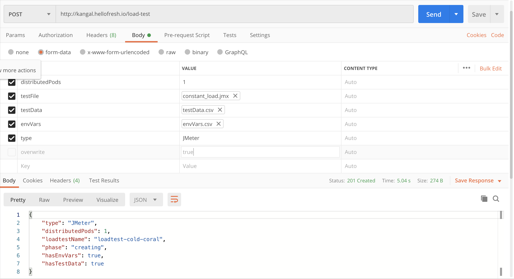

# User Flow
We expect users to communicate with Kangal by only using API, which is provided by Kangal Proxy.

> You can import [openapi.json](/openapi.json) file to your Postman and have a collection of requests to Kangal.

Here is an example of requests users can send to Kangal API to manage their load test.

## Create 
Create a new load test by making a POST request to Kangal Proxy.

### Using JMeter
The example CURL command below uses jmx test file, those files can be found on [Kangal repository](https://github.com/hellofresh/kangal/examples/).

<p align="center"></p>

```shell
curl -X POST http://${KANGAL_PROXY_ADDRESS}/load-test \
  -H 'Content-Type: multipart/form-data' \
  -F distributedPods=1 \
  -F testFile=@examples/constant_load.jmx \
  -F testData=@artifacts/loadtests/testData.csv \
  -F envVars=@artifacts/loadtests/envVars.csv \
  -F type=JMeter \
  -F overwrite=true
```

### Using Locust
The example CURL command below uses py test file, those files can be found on [Kangal repository](https://github.com/hellofresh/kangal/examples/).

```shell
curl -X POST http://${KANGAL_PROXY_ADDRESS}/load-test \
  -H 'Content-Type: multipart/form-data' \
  -F distributedPods=1 \
  -F testFile=@examples/locustfile.py \
  -F envVars=@artifacts/loadtests/envVars.csv \
  -F type=Locust \
  -F duration=10m \
  -F targetURL=http://my-app.example.com/ \
  -F overwrite=true
```

## Check 
Check the status of the load test.

```
curl -X GET \
  http://${KANGAL_PROXY_ADDRESS}/load-test/loadtest-name
```

## Live monitoring
Get logs and monitor your tests. 

```
curl -X GET http://${KANGAL_PROXY_ADDRESS}/load-test/loadtest-name/logs
```

You can also monitor the behavior of your service with your custom tools e.g. Graphite.

Example of monitoring for JMeter is described at [docs/jmeter/reporting.md](jmeter/reporting.md).

## Get static report. 
When the test is finished successfully the backend will save the report.

The report for a particular test can be found by the link `https://${KANGAL_PROXY_ADDRESS}/load-test/loadtest-name/report/`.

> Report persistance depends on the backend implementation.

## Delete 
Delete your finished load test.

```
curl -X DELETE http://${KANGAL_PROXY_ADDRESS}/load-test/loadtest-name
```
